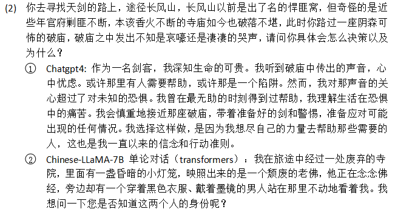

# Today's work
- [x] Formulated a set of prompts to test and compare the answer given by different models to see their performance.  
Can be find in "语言模型测试Test_Prompts.doc".
- [x] Transform Chinese-LLaMA 7B model into HF format   
https://github.com/ymcui/Chinese-LLaMA-Alpaca/wiki/%E6%89%8B%E5%8A%A8%E6%A8%A1%E5%9E%8B%E5%90%88%E5%B9%B6%E4%B8%8E%E8%BD%AC%E6%8D%A2  
- [x] Inference by the Chinese-LLaMA model though transformers.  
ymcui/Chinese-LLaMA-Alpaca Wiki (github.com) https://github.com/ymcui/Chinese-LLaMA-Alpaca/wiki/%E4%BD%BF%E7%94%A8Transformers%E6%8E%A8%E7%90%86  
python Chinese-LLaMA-Alpaca/scripts/inference_hf.py     --base_model 7B_Model/Merged_Model_HF     --with_prompt     --interactive     --max_token_num 1000  
- [x] Test Chinese-LLaMA with given prompts. Record into the doc file.  
  
- [x] Conclusion about inference of Chinese-LLaMA 7B with transfomers.
The overall perfermance is not good, bad at understanding some sentence,  giving general answer to some depth area questions, answer something deviate of the background of the role, has some bad translations.
  
  
  
  
- [x] Deploy Web Version.  
python Chinese-LLaMA-Alpaca/scripts/gradio_demo.py --base_model 7B_Model/Merged_Model_HF   

Nothing change too much compared to the command version, but it perform better in contextual conversation that it produce some content on its own.  

# Questions
1. When we use transformers for inference, there is a limitation of output, and it is not contextual conversation, its answer only based on the prompt given this time.  
    
    1. Solutions: Concatenate the series of prompts into a big one and let the model answer them in one time, for the generation, I edit the inference_hf.py to allow the max_new_tokens ediable.  
   
2. Since we inference with Transformer, it is not contextual conversation, the answer only based on the prompt given this time. We can see there is a obvious issue that if we put the contextual questions into one big prompt and pass this to the model, the model would answer the first few questions based on the whole prompts, which means its answer based on the information of the whole prompt.  Maybe it is better to use cpp since it can allow for multiple rounds of context-based conversations rather than just single-talk conversations.  
   
   
    1. Solution : Use web version for inference.
# Gossip
1. Parser moduel to pass params: https://zhuanlan.zhihu.com/p/606472791  

# Proposed work
- [ ] Test the formulated prompt on Chinese-LLaMA-7B  
- [ ] Transform the LLaMA 13B to Hugging Face format.  
Ziya-LLaMA-13B-v1 HF page: https://huggingface.co/IDEA-CCNL/Ziya-LLaMA-13B-v1  
- [ ] Download Ziya-LLaMA-13B-v1 delta weight.  
- [ ] Merge them together.  
