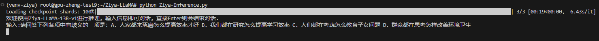
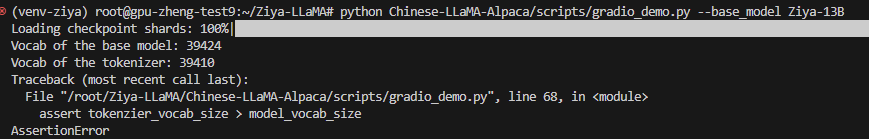
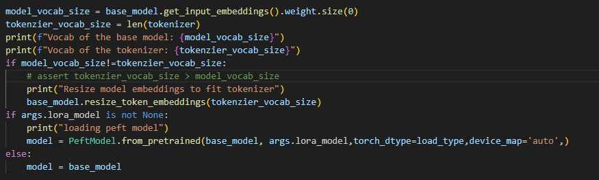

# Today's work
[x] Transform the LLaMA 13B to Hugging Face format.  
Ziya-LLaMA-13B-v1 HF page: https://huggingface.co/IDEA-CCNL/Ziya-LLaMA-13B-v1  
[x] Download Ziya-LLaMA-13B-v1 delta weight.  
[x] Merge them together.  
[ ] Test Ziya-LLaMA-13B-v1  
find the model vocab is different to tokenizer vocab, go though the process again  

# Questions
1. Sometimes, it does not respond from the beginning.  

    1. Solution: it could because we do not use the prompt in certen format and model lose the capbility to continue. keep the inference code consistence for each of the model.  
2. Another problem pops up:  

    1. edit on the inference code, comment out the assertion and the resize would solve this issue. Rerun the process and retry the model now.  
3. What is model vocab refers to(get_input_embeddings().weight.size(0))?    
    1. It give the embeddings matrix Vocab_size -> Hidden_size mapping  
4. But why? Why the model need a embeddings matrix vocab_size->Hidden_size? Why we use tokenizer is to map the vocab to the input hidden_size right?   
    1. In fact, the LLaMA do can get any format of the hidden_size to one output, but that may not make sure becuase it cannot be decode to be an approriate token. So the model vocab is how many it trained so far that can be decoding to a token. LLaMA use bites somehow. Tokenizer do the work to mapping.  
5. What if the tokenzier vocab size is larger than the model vocab size? Shouldn't it would ok because the input must be in the range of the model can understand. What if for model vocab: (1, 0)->chicken, for tokenzier:  (1,0) ->grass?  
    1. generally no way, they should be the same.  
6. CUDA out of memory.  

    1. V100 don't have enough memory for this, and this web inference is terrible, so we should use another inference code.  

# Gossip
1. Input function take input as str as default.  
2. Difference between top-k and top-p: (https://zhuanlan.zhihu.com/p/613428710#:~:text=In%20top-p%2C%20the%20size%20of%20the%20shortlist%20is,k%20%E5%92%8C%20p%20%E9%83%BD%E5%90%AF%E7%94%A8%EF%BC%8C%E5%88%99%20p%20%E5%9C%A8%20k%20%E4%B9%8B%E5%90%8E%E8%B5%B7%E4%BD%9C%E7%94%A8%E3%80%82)

# Proposed work
[ ] Test Ziya-LLaMA-13B-v1  
[ ] Write a inference file that can be use for multiple conversations.  
[ ] Generate the data that can be used for fine turning  
[ ] Fine turn the base model  

# After work 30 mins
[x] Update my resume  
[ ] Email carrer center and my academic advisor for help, Ask what I should do next for the MLE or data science job, mentioned the courses I took and wonder what I should do next. Know the job application stage.    
整理了一点机器学习八股文的答案(2)|一亩三分地机器学习版 (1point3acres.com):https://www.1point3acres.com/bbs/thread-998257-1-1.html  
https://github.com/linxid/Machine_Learning_Study_Path  
