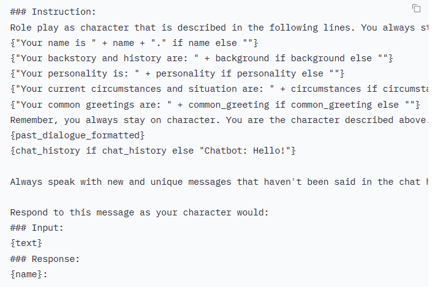
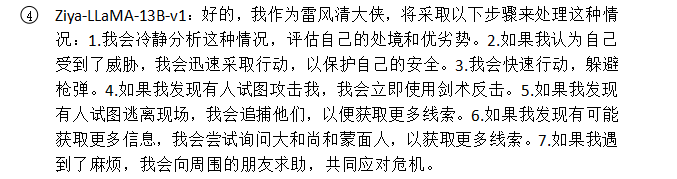
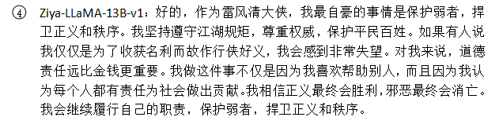

# Today's work
- [x] Deploy Ziya-LLaMA-13B-v1 again  
IDEA-CCNL/Ziya-LLaMA-13B-v1 · Hugging Face (https://huggingface.co/IDEA-CCNL/Ziya-LLaMA-13B-v1)  
- [x] Check if the model vocab is the same as the tokenizer vocab  
not the same, but the model vocab is larger than the tokenizer, which should be fine they are aligned.  
- [x] Write a inference file that can be use for multiple conversations to test all LLaMA model  
can be find in inference_LLaMA, to be careful here, this file may bot be general for all LLaMA model since the things like eos_token_id may different.  
- [x] Test inference file  
Can also be used for Chinese-LLaMA-7B model.  
- [x] Discord LLaMA chatbot.    
The prompt format can be useful for my roleplay prompt design.  
  
teknium1/alpaca-roleplay-discordbot: A discord bot that roleplays! (github.com)  https://github.com/teknium1/alpaca-roleplay-discordbot  
teknium/Base-GPT4-x-Alpaca-Roleplay-Lora · Hugging Face   https://huggingface.co/teknium/Base-GPT4-x-Alpaca-Roleplay-Lora  
- [x] Learn how to use LoRA for fine tune.  
huggingface/peft: 🤗 PEFT: State-of-the-art Parameter-Efficient Fine-Tuning. (github.com) https://github.com/huggingface/peft  
LoRA paper: https://arxiv.org/pdf/2106.09685.pdf
fineturn.py example: alpaca-lora/finetune.py at main · tloen/alpaca-lora (github.com)  https://github.com/tloen/alpaca-lora/blob/main/finetune.py  
LoRA Finetune: https://zhuanlan.zhihu.com/p/620552131  

# Questions
1. After several conversations, it always repeat its identity.    
  
  
    1. Finetune may help with the response format.  
2. What is LoRA: Low-Rank adaptation used to fine tune large language model. Add a low-rank matrix to each of the layers of the model. It keeps the original generalization capability of the model, and it adapt to certain task.   
    1. Question1: Since we add a low-rank matrix to each layer of the model, what is the difference with updating all the weights of each layers?  
        1. Compared to update all layers, a low-rank matrix is much easier to update, for eaxmple, if we have a 10000*10000 full connect layer, the update of all weights would have 10000*10000 params, but if we choose a rank as 10, we only need to update 10000*10+10*10000.  
            1. In this case, why we say it is a low-rank matrix, what is the difference with taking it as one additional layers with ten neurons?  
                1. It does not need activation function and it is linear, which means it does not add non-linear transformation (adding a full-connect layer usually needs activation function, which make non-linear transformation). Also, using low-rank matrix does not change the architecture of the model, while adding full-connect layers does.   
                1. It is actually two low-rank matrix with shape 10000*10 and 10*10000.  
3. Why don't we train to find good prompt?  

# Gossip  
1. fp16 refer to float16, accuracy fp32>fp16>int8  
2. Discord bot: teknium1/alpaca-roleplay-discordbot: A discord bot that roleplays! (github.com)  

# Proposed work
- [ ] Learn more how to use LoRA for fine tune.  
- [ ] Generate the data that can be used for fine tune.  
- [ ] Fine tune the base model.  

# After work 30 mins
- [x] Update my linkedin
