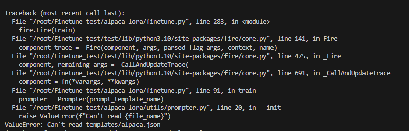
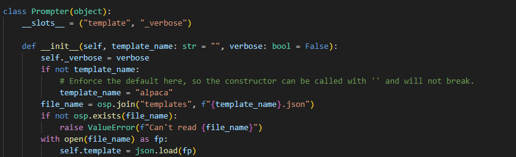
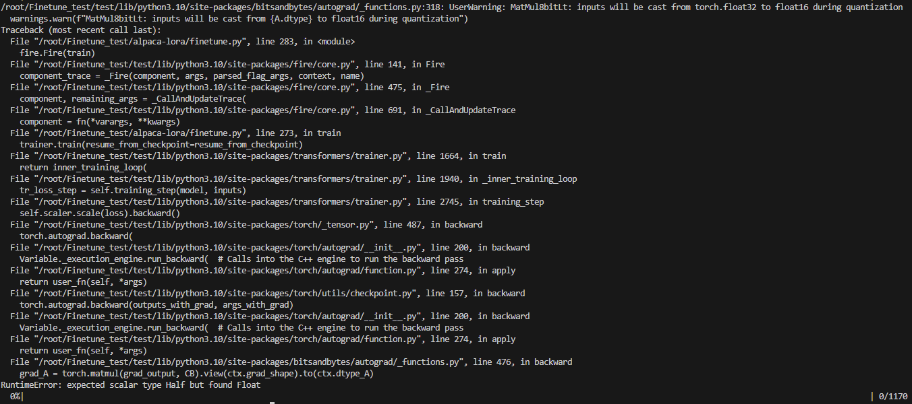
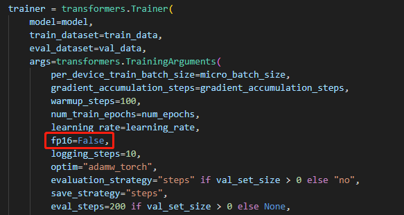

# Today's work
- [x] Learn how to use LoRA for fine tune.  
huggingface/peft: 🤗 PEFT: State-of-the-art Parameter-Efficient Fine-Tuning. (github.com)  https://github.com/huggingface/peft  
2106.09685.pdf (arxiv.org)  https://arxiv.org/pdf/2106.09685.pdf  
fineturn.py example: alpaca-lora/finetune.py at main · tloen/alpaca-lora (github.com)  https://github.com/tloen/alpaca-lora/blob/main/finetune.py  
Cleaned Alpaca Dataset example: gururise/AlpacaDataCleaned: Alpaca dataset from Stanford, cleaned and curated (github.com) https://github.com/gururise/AlpacaDataCleaned  
- [x] Use alpaca_data_gpt4 to fine tune the Ziya  
take around 66 hours to train on V100  

# Questions
1. When test the fine tune on the gpt4 data, it shows ValueError: Can't read templates/alpaca.json  
  
    1. Solution: This is beacuase in prompter.py file, it set the relative path as templates/alpaca.json. Therefore, we need to cd into alpaca-lora, and then put our finetune model in the same file.  
   
2. RuntimeError: expected scalar type Half but found Float  
  
    1. Solution: This is because the bitsandbytes not working for V100 GPUs  
    
        i. expected scalar type Half but found Float · Issue #485 · tloen/alpaca-lora (github.com)   https://github.com/tloen/alpaca-lora/issues/485  

# Gossip
1. type half is half float: fp16. AMP  
    a.  半精度浮点数Half - 知乎 (zhihu.com) https://zhuanlan.zhihu.com/p/50382145    
    b. pytorch模型训练之fp16、apm、多GPU模型、梯度检查点（gradient checkpointing）显存优化等 - 知乎 (zhihu.com) https://zhuanlan.zhihu.com/p/448395808  

# Proposed work
- [ ] Generate the roleplay data from GPT4 that can be used for fine tune Ziya  
- [ ] Fine tune the Ziya model  

# After work 30 mins(6:00 Off work for friday, no 30 mins today)
- [x] apply for fall job
[ ] Join leetcode weekly competation
[ ] After 9:30, Enroll NLP courses
[ ] Create a data scientist resume
