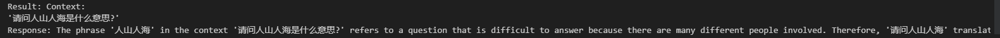
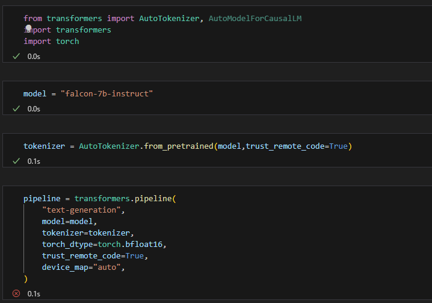
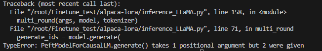
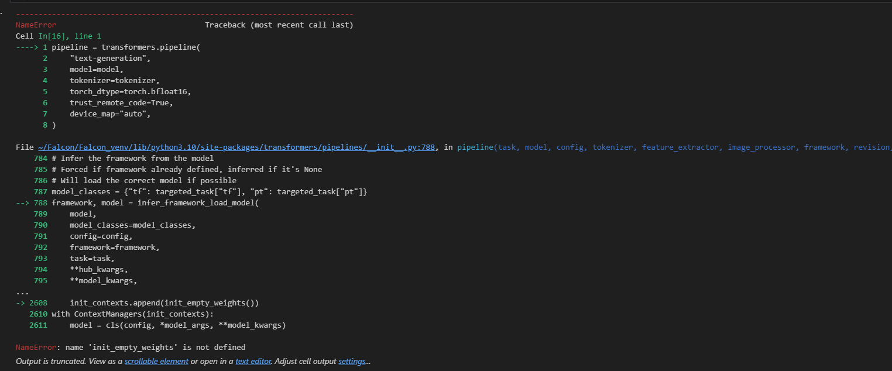
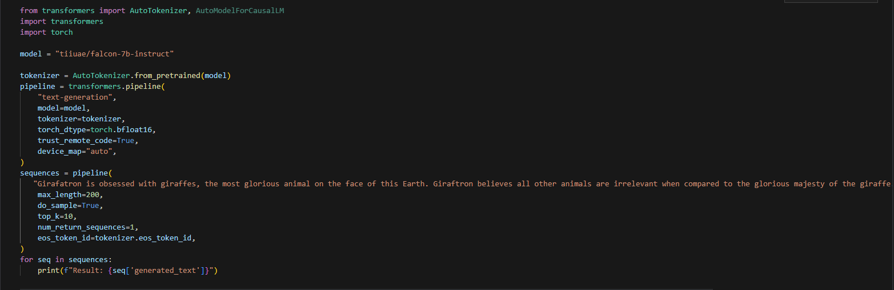
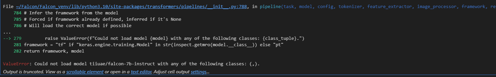
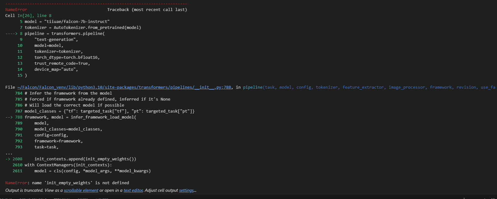
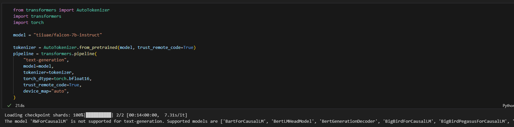
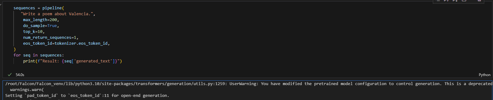

# Today's work
- [x] Finish the fine turn on Ziya with alpaca_data_gpt4  
- [x] Finish the induction training  
- [x] Use the fine turn model and test it  
Since it is not merged, I am not using the inference code I wrote before, Just test with the generate.py with in Alpaca-LoRA repo.  
- [x] Edit on my inference code  
- [x] falcon-7b-instruct instruct deploy  
tiiuae/falcon-7b-instruct · Hugging Face https://huggingface.co/tiiuae/falcon-7b-instruct  
The Falcon has landed in the Hugging Face ecosystem https://huggingface.co/blog/falcon  
- [x] test falcon-7b-instruct  
tiiuae/falcon-7b-instruct · Example Use (huggingface.co) https://huggingface.co/tiiuae/falcon-7b-instruct/discussions/1  
bad at Chinese, need fine tune 

# Questions
1. Edit my LLaMA code but the problem is the PeftModel may need different generation parameters.   
  
  
    1. Solution: Use GenerationConfig to format the parameters since the PEFT rewrite the generate function.     
2. Use local falcon model, init_empty_weights issue:  
  
    1. use transfomers library instead  
3. Load model issue:  
  
  
    1. retry several times, but it still shows 'init_empty_weights' is not defined  
  

# Gossip
1. Possible concerns:   
    1. The model 'RWForCausalLM' is not supported for text-generation. Supported models are ['BartForCausalLM', 'BertLMHeadModel', 'BertGenerationDecoder', 'BigBirdForCausalLM', 'BigBirdPegasusForCausalLM', 'BioGptForCausalLM', 'BlenderbotForCausalLM', 'BlenderbotSmallForCausalLM', 'BloomForCausalLM', 'CamembertForCausalLM', 'CodeGenForCausalLM', 'CpmAntForCausalLM', 'CTRLLMHeadModel', 'Data2VecTextForCausalLM', 'ElectraForCausalLM', 'ErnieForCausalLM', 'GitForCausalLM', 'GPT2LMHeadModel', 'GPT2LMHeadModel', 'GPTBigCodeForCausalLM', 'GPTNeoForCausalLM', 'GPTNeoXForCausalLM', 'GPTNeoXJapaneseForCausalLM', 'GPTJForCausalLM', 'LlamaForCausalLM', 'MarianForCausalLM', 'MBartForCausalLM', 'MegaForCausalLM', 'MegatronBertForCausalLM', 'MvpForCausalLM', 'OpenLlamaForCausalLM', 'OpenAIGPTLMHeadModel', 'OPTForCausalLM', 'PegasusForCausalLM', 'PLBartForCausalLM', 'ProphetNetForCausalLM', 'QDQBertLMHeadModel', 'ReformerModelWithLMHead', 'RemBertForCausalLM', 'RobertaForCausalLM', 'RobertaPreLayerNormForCausalLM', 'RoCBertForCausalLM', 'RoFormerForCausalLM', 'RwkvForCausalLM', 'Speech2Text2ForCausalLM', 'TransfoXLLMHeadModel', 'TrOCRForCausalLM', 'XGLMForCausalLM', 'XLMWithLMHeadModel', 'XLMProphetNetForCausalLM', 'XLMRobertaForCausalLM', 'XLMRobertaXLForCausalLM', 'XLNetLMHeadModel', 'XmodForCausalLM'].  ![generate issue6]  
  
    3. UserWarning: You have modified the pretrained model configuration to control generation. This is a deprecated strategy to control generation and will be removed soon, in a future version. Please use a generation configuration file (see https://huggingface.co/docs/transformers/main_classes/text_generation) warnings.warn( Setting `pad_token_id` to `eos_token_id`:11 for open-end generation.
Proposed work  
  

- [ ] deploy falcon-7b locally  
tiiuae/falcon-7b · Hugging Face  https://huggingface.co/tiiuae/falcon-7b
- [ ] fine tune falcon-7b model with alpaca-en-ch data  
A-baoYang/alpaca-7b-chinese: Finetune LLaMA-7B with Chinese instruction datasets (github.com) https://github.com/A-baoYang/alpaca-7b-chinese/tree/main  
Making LLMs even more accessible with bitsandbytes, 4-bit quantization and QLoRA (huggingface.co) https://huggingface.co/blog/4bit-transformers-bitsandbytes  
tiiuae/falcon-7b · Hugging Face https://huggingface.co/tiiuae/falcon-7b  
falcon_peft.py (github.com) https://gist.github.com/pacman100/1731b41f7a90a87b457e8c5415ff1c14  
artidoro/qlora: QLoRA: Efficient Finetuning of Quantized LLMs (github.com) https://github.com/artidoro/qlora/  
A Gentle Introduction to 8-bit Matrix Multiplication for transformers at scale using transformers, accelerate and bitsandbytes (huggingface.co) https://huggingface.co/blog/hf-bitsandbytes-integration  

# After work 30 mins
- [x] Generative AI, Hung-yi Lee one courses   
- [x] Last week leetcode contest q3   
- [ ] Last week leetcode contest q4   
- [ ] After 9:30, Enroll NLP courses    
- [ ] Create a data scientist resume    
- [ ] apply for fall job  
