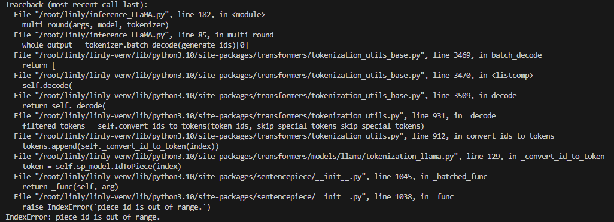

# Today's work
- [x] Figure out what exact each file works for, why weight? what it means to merge two weight? when and how?  
- [x] download linly-Chinese-LLaMA-13B model v1.2 verson  
- [x] Test linly-Chinese-LLaMA-13B model v1.2 verson  
it performs bad, I think it is beacuse it is a base model and not fine tune for conversation.  
- [x] deploy Linly-OpenLLaMA model  
- [x] Test Linly-OpenLLaMA model  
- [x] Fine tune Linly-OpenLLaMA model with LoRA  
tloen/alpaca-lora: Instruct-tune LLaMA on consumer hardware (github.com)  https://github.com/tloen/alpaca-lora   
python finetune.py     --base_model 'Open-Linly-13b'     --data_path 'revised_dialog_conversation_100.json'     --output_dir './fintune-Linly'  
python inference_LLaMA.py --base_model Open-Linly-13b --lora_model finetune-Linly  
- [ ] Use Chinese-LLaMA-7B model  

# Questions
1. IndexError: piece id is out of range.   
  
    1. Solution: Tokenizer issue, since openLLaMA use spm tokenizer.  
2. UserWarning: WARNING: Compute capability < 7.5 detected! Only slow 8-bit matmul is supported for your GPU! warn(msg)  
    1. load in 8 bit  

# Gossip
1. transfer learning:   
    a. http://t.csdn.cn/Mtf7M   
    b. http://t.csdn.cn/hmxQP  
2. Intro about the files in the HF: Huggingface 超详细介绍 - 知乎 (zhihu.com)  https://huggingface.co/docs/transformers/v4.30.0/en/pipeline_tutorial  
3. 在 HuggingFace Transformer 模型中，以下是一些常见文件的解释：  
    1. .pth 或 .bin 文件: 这些文件通常包含模型权重。这些权重是通过训练模型得到的，用于对新的输入数据进行预测。.pth 是 PyTorch 保存模型权重的一种格式，.bin 文件则是 HuggingFace 特有的模型权重保存格式。.pth or .bin files: These usually contain the model weights. These are learned during the training of the model and are used to make predictions on new input data. .pth is a format used by PyTorch to save model weights, and .bin files are a model weights format specific to HuggingFace.  
    2. tokenizer.json: 这是 tokenizer 的词汇表，用于将文本转换为模型可以理解的数字或令牌。模型训练时会生成此文件。tokenizer.json: This is the vocabulary of the tokenizer, used to convert text into numbers or tokens that the model can understand. This file is generated during the training of the model.  
    3. tokenizer.model: 适用于特定的tokenizers，如SentencePiece。这是预训练的 tokenizer 模型，用于将文本分割成令牌。tokenizer.model: Applicable to specific tokenizers like SentencePiece. It is a pre-trained tokenizer model used to tokenize the text into tokens.  
    4. tokenizer_config.json: 这是 tokenizer 的配置文件。它包含 tokenizer 运行所需的所有信息，比如用于分词的特殊字符、是否需要降低字母的大小写等。tokenizer_config.json: This is the configuration file for the tokenizer. It contains all the information needed for the tokenizer to run, such as the special characters used for tokenization, whether or not to lower case letters, etc.  
    5. config.json: 这是模型的配置文件。它包含模型的所有参数，例如隐藏层的大小、注意力头的数量、是否使用层归一化等。config.json: This is the configuration file for the model. It contains all the parameters of the model, such as the size of hidden layers, number of attention heads, whether or not to use layer normalization, etc.  
    6. pytorch_model.bin.index.json: 这可能是 PyTorch 模型文件的索引。pytorch_model.bin.index.json: This could be an index for the PyTorch model file.  
    7. special_tokens_map.json: 这是一个包含特殊令牌及其对应 ID 的映射的 JSON 文件。特殊令牌通常包括例如开始、结束、未知或填充等特殊符号。special_tokens_map.json: This is a JSON file containing a mapping of special tokens and their corresponding IDs. Special tokens usually include special symbols such as start, end, unknown, padding, etc.  
    8. checklist.chk 与 tokenizer_checklist.chk: 存储模型和tokenizer的MD5值。checklist.chk and tokenizer_checklist.chk: Storage of the MD5 value for model and tokenizer.    
4. 当你调用from_pretrained方法时，实际上会发生以下几件事：When you call the from_pretrained method, the following steps occur:  
    1. 首先，根据传入的模型名或路径，方法会定位到对应的模型文件夹。如果是模型名，如bert-base-uncased，那么将从HuggingFace的模型仓库中下载对应的模型文件。First, based on the given model name or path, the method locates the corresponding model folder. If it's a model name, like bert-base-uncased, it downloads the corresponding model files from HuggingFace's model repository.  
    2. 然后，加载模型的配置文件config.json。这个文件包含了模型架构的参数，例如隐藏层的大小、注意力头的数量等。Then, it loads the model's configuration file config.json. This file contains parameters for the model architecture, such as the size of hidden layers, number of attention heads, etc.  
    3. 之后，使用这些配置参数实例化一个新的模型对象。Afterwards, it instantiates a new model object using these configuration parameters.  
    4. 最后，加载模型权重文件（通常为.bin文件），并将这些权重赋值给新创建的模型对象。Finally, it loads the model weights file (usually a .bin file) and assigns these weights to the newly created model object.  
5. FineTune得到的：Get from finetune:  
    1. adapter_config.json: 这是 Adapter 的配置文件，包含了如何设置和使用 Adapter 的信息。The configutration file of Adapter, containing about how to set and use information of Adapter.  
    2. adapter_model.bin: 这是 Adapter 的权重文件，保存了 Adapter 在特定任务上训练得到的权重。The weight file of Adapter, which stores the weights that trained on special task.  

# Proposed work  

# After work 30 mins
- [ ] Pipelines for inference (huggingface.co)  https://huggingface.co/docs/transformers/v4.30.0/en/pipeline_tutorial  
- [ ] Last week leetcode contest q4  
- [ ] After 9:30, Enroll NLP courses  
- [ ] Create a data scientist resume  
- [ ] apply for fall job  
