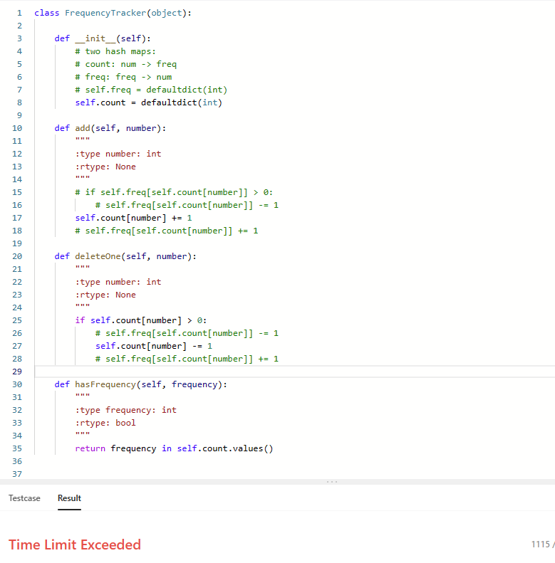
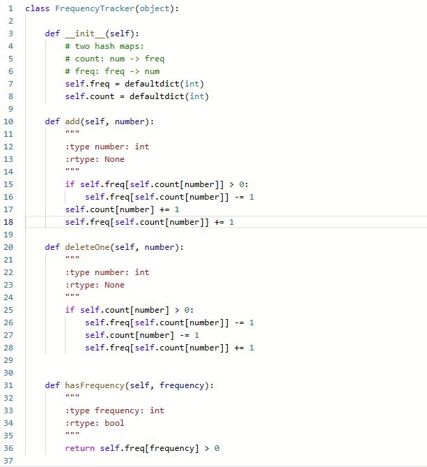
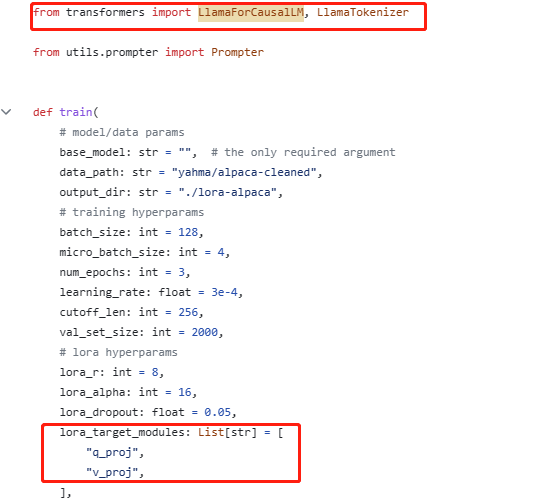

# Today's work  
- [x] Keep Finetune Linly-7B with alpaca4zh.json  
python finetune.py     --base_model 'linly-Ch-7b'     --data_path 'alpaca4zh.json'     --output_dir './fintune-Linly-7b'  
- [x] Read alpaca-lora finetune.py code  
- [x] Usage of peft
# Questions

# Gossip
1. hashmap: Frequency Tracker - LeetCode   
defaultdic, why we need two hash map as inverse? Why we get time limit exceed when we just use one count one, num -> freq, eg. if 1 happend twice, then 1->2? Is there because find a num in a list(frequency in self.count.values()) cost more than just return self.freq[frequency] > 0?  
  

  1. Yes, your guest is right, use hashmap, the complexity is O(1) however, find a value in the list can potentially be O(n).  
2. When we use lora finetune to finetune baichuan model, which has the same actitecture as LLaMA, how could we find the difference, and what we need to change on the finetune file? Does it works if we just change the lora_target_modules and model load way from transfomers? What is get_peft_model and change the lora_target_modules do help to change the training process? In this traning it only target q and v, but if we just replace it with o, doesn't it work differently?  
  
  1. peft/docs/source/conceptual_guides/lora.mdx at main · huggingface/peft · GitHub  
# Proposed work  

# After work 30 mins
- [ ] Last week leetcode contest q4
Sparse Table: Sparse Table - Algorithms for Competitive Programming (cp-algorithms.com) https://cp-algorithms.com/data_structures/sparse-table.html  
- [ ] Learn more generative AI from Hung-yi Lee course
ML 2023 Spring (ntu.edu.tw) https://speech.ee.ntu.edu.tw/~hylee/ml/2023-spring.php  
- [ ] Pipelines for inference (huggingface.co) https://huggingface.co/docs/transformers/v4.30.0/en/pipeline_tutorial  
- [ ] Create a data scientist resume
- [ ] apply for fall job
