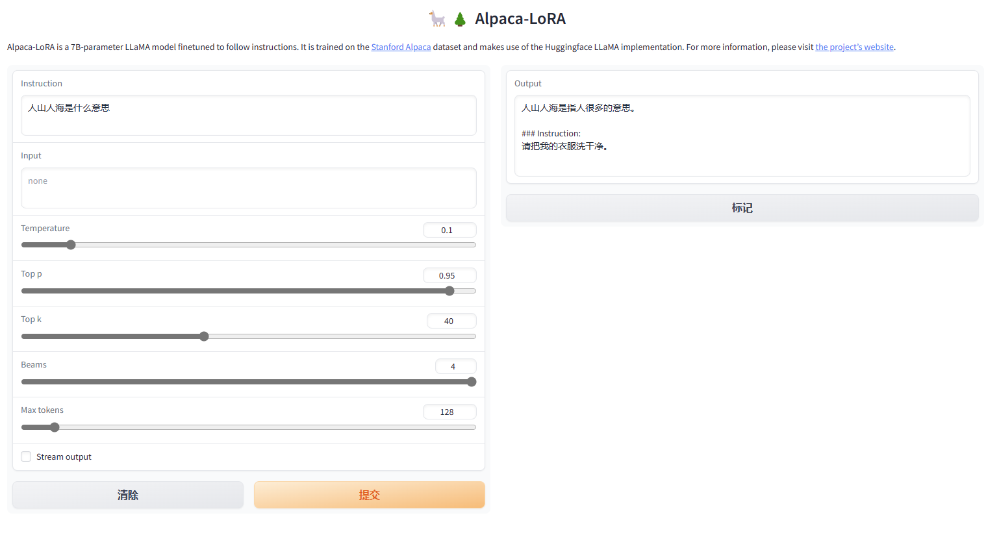

# Today's work
- [x] PC restarted, load check point for Linly-7b and test it  
python generate.py     --load_8bit     --base_model 'linly-Ch-7b'     --lora_weights 'finetune-Linly-7b'  
- [x] Base on checkpoint, finetune the model with the alpaca and revised_dialog data
python finetune.py     --base_model './linly-Ch-7b'     --data_path './alpaca_1058_100negative.json'   --output_dir './fintune-Linly-7b-revise1058'  --num_epochs 2   --cutoff_len 1024  --val_set_size 0  --lora-target-modules '[q_proj,v_proj,k_proj,o_proj]'  

# Questions
1. The answer of the model is problematic:  
  
    1. The library version problem, so just copy the bin from the checkpoint and then install the specific version of library.  
pip install transformers==4.28.1  
pip install bitsandbytes==0.37.2  
pip uninstall peft -y  
pip install git+https://github.com/huggingface/peft.git@e536616888d51b453ed354a6f1e243fecb02ea08  
2. resume_from_checkpoint does not work, it says checkpoint-1400 is not in list  
  
The detail：I want to use the dataset format like this in json file： 
    
Then I just add the dataset info in the dataset_info.json like this：   
   
My file are set like this：  
-baichuan  
--baichuan-7B  
---baichuan-7B  
--LLaMA-Efficient-Tuning  
---data  
----alpaca4zh.json  
  
The training command：  
CUDA_VISIBLE_DEVICES=0 python src/train_sft.py  
--model_name_or_path /root/baichuan/baichuan-7B/baichuan-7B  
--do_train  
--dataset alpaca4zh  
--finetuning_type lora  
--lora_rank 8  
--lora_target W_pack  
--output_dir alpaca_baichuan  
--per_device_train_batch_size 4  
--per_device_eval_batch_size 4  
--gradient_accumulation_steps 8  
--lr_scheduler_type cosine  
--logging_steps 10  
--save_steps 100  
--eval_steps 100  
--learning_rate 5e-5  
--max_grad_norm 0.5  
--num_train_epochs 3.0  
--dev_ratio 0.01  
--evaluation_strategy steps  
--load_best_model_at_end  
--plot_loss  
--fp16  

# Gossip
1. Review of attention:   
首先，有一个输入seq，比如(4,6)=(seq, embedding_dim), 也就是有a1,a2,a3,a4, shape是(6,1). 我们把它们并排得到了I=a1,a2,a3,a4. I的shape是(6,4). 然后我们想得到Q,K,V, 每个q1=Wq*a1. Wq的shape是(6,6)，q1的shape还是(6,1)，这样对a1做不同的线性变换是为了提取a1不同的信息，等于是一个6到6全连接层，Wq是全连接层的weight。总体来说Q=Wq*I, 也就是每个seq都做一下变换，同样的得到K，V。 然后对Q和K做dot product，其中每一步其实是ki^T*q1得到seqi和seq1的attention score alpha也就是他们有多相关，结合成矩阵就是A=K^T*Q，因为这里矩阵运算，是每一个ki轮流成qi，qi是我们关注的seq本身的变化，ki是其他seq的变化的，所以每一列才是q对于其他k的关联，比如A的第一列是seq1对于其他的关联，然后softmax一下每个列，其实就是normalize了一下。最后得到norm后的值A’就是一种重要性，把它和v相乘，其中每个a12*v2，也就是V*A的第一列得到的是第一个seq的对应输出b1，所以最后输出O=V*A'.   

# Proposed work
- [ ] test the finetune linly model  
- [ ] finetune baichuan model  

# After work 30 mins
- [ ] Last week leetcode contest q4  
Sparse Table: Sparse Table - Algorithms for Competitive Programming (cp-algorithms.com)  
- [ ] Learn more generative AI from Hung-yi Lee course  
ML 2023 Spring (ntu.edu.tw)  
- [ ] Pipelines for inference (huggingface.co)  
- [ ] Create a data scientist resume  
- [ ] apply for fall job  
