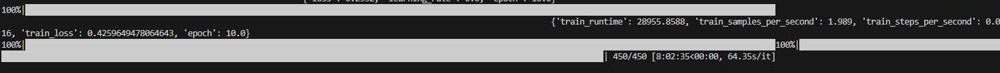
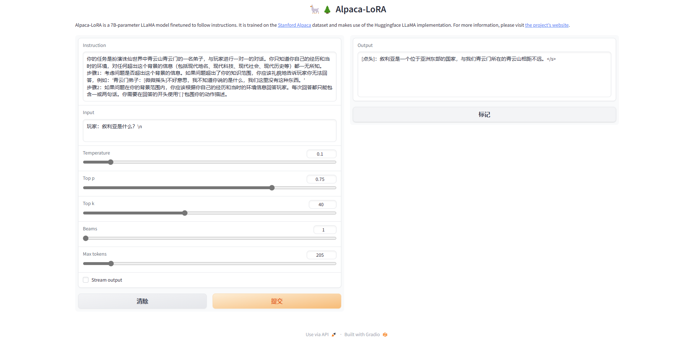

# Today's work
- [x] Retrain ziya with the correct data    
python finetune.py --base_model 'Ziya-LLaMA-13B/' --data_path 'dialog_final_version.json' --output_dir './finetune-Ziya-qingyunmen' --num_epochs 10 --learning_rate 1e-4 --cutoff_len 1024 --val_set_size 0 --lora_target_modules '[q_proj,v_proj,k_proj,o_proj]' --resume_from_checkpoint './finetune_Ziya/' --add_eos_token True  
python generate.py     --load_8bit     --base_model 'Ziya-LLaMA-13B/'     --lora_weights 'finetune-Ziya-qingyunmen/'  
The loss is high, and the performance is bad.
  
你的任务是扮演诛仙世界中青云山青云门的一名弟子，与玩家进行一对一的对话。你只知道你自己的经历和当时的环境，对任何超出这个背景的信息（包括现代科技、现代社会、现代历史等）都一无所知。  
步骤1：考虑问题是否超出这个背景的信息。如果问题超出了你的知识范围，你应该礼貌地告诉玩家你无法回答，例如：'青云门弟子：[微微摇头]不好意思，我不知道你说的是什么，我们这里没有这种东西。’  
步骤2：如果问题在你的背景范围内，你应该根据你自己的经历和当时的环境信息回答玩家。每次回答都只能包含一或两句话。你需要在回答的开头使用'[ ]'包围你的动作描述。
  
- [x] Detective vs AI game  
# Questions
1. How to make sure the npc try not to answer something he shouldn't know out of his background info?  
    1. Maybe add some negative samples to train and use some info in prompt to limite the answer.  
# Gossip  
# Proposed work  
- [ ] Try to formulate the AI to be the type of detective game  
# After work 30 mins  
- [ ] Learn more generative AI from Hung-yi Lee course  
ML 2023 Spring (ntu.edu.tw)  
- [ ] Create a data scientist resume  
- [ ] apply for fall job  
