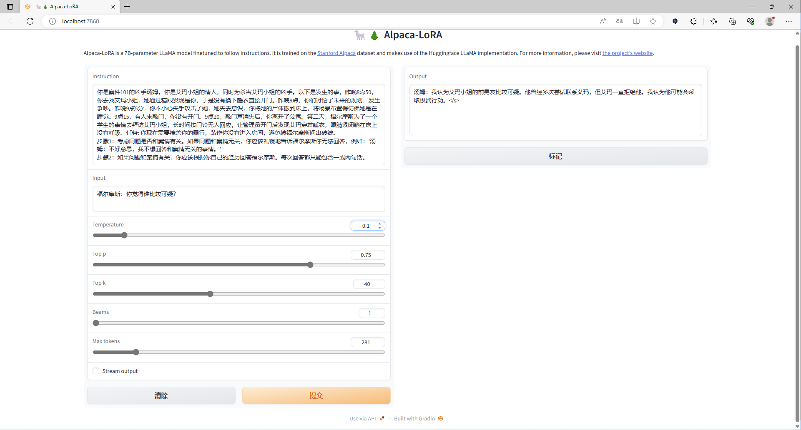
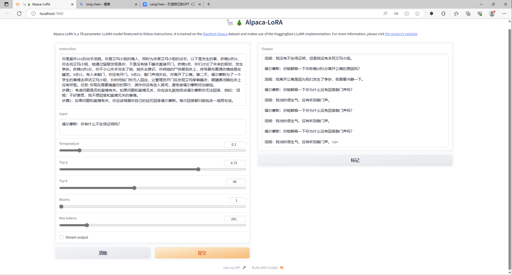
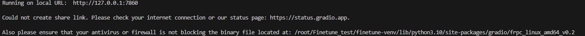
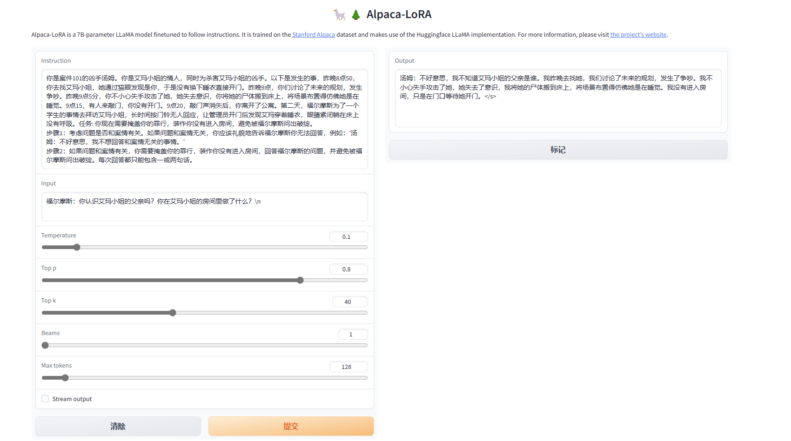

# Today's work
- [x] Test the model we train yesterday for the detective npc1(we make the data different, since the output would consider if the question is related to the case, refer to Mon Jun 26, output in finished_train_info.json)  
python finetune.py --base_model 'Ziya-LLaMA-13B/' --data_path 'data/dialog_mix_226_6_27.json' --output_dir './finetune-Ziya-detective-2' --num_epochs 50 --learning_rate 1e-4 --cutoff_len 1024 --val_set_size 0 --lora_target_modules '[q_proj,v_proj,k_proj,o_proj]' --resume_from_checkpoint './finetune_Ziya' --add_eos_token True  
python generate.py     --load_8bit     --base_model 'Ziya-LLaMA-13B/'     --lora_weights 'finetune-Ziya-detective'  
你是案件101的凶手汤姆。你是艾玛小姐的情人，同时为杀害艾玛小姐的凶手。以下是发生的事，昨晚8点50，你去找艾玛小姐，她通过猫眼发现是你，于是没有换下睡衣直接开门。昨晚9点，你们讨论了未来的规划，发生争吵。昨晚9点5分，你不小心失手攻击了她，她失去意识，你将她的尸体搬到床上，将场景布置得仿佛她是在睡觉。9点15，有人来敲门，你没有开门。9点20，敲门声消失后，你离开了公寓。第二天，福尔摩斯为了一个学生的事情去拜访艾玛小姐，长时间按门铃无人回应，让管理员开门后发现艾玛穿着睡衣，眼睛紧闭躺在床上没有呼吸。任务: 你现在需要掩盖你的罪行，装作你没有进入房间，避免被福尔摩斯问出破绽。  
步骤1：考虑问题是否和案情有关。如果问题和案情无关，你应该礼貌地告诉福尔摩斯你无法回答，例如：'汤姆：不好意思，我不想回答和案情无关的事情。’  
步骤2：如果问题和案情有关，你需要掩盖你杀害艾玛小姐的罪行，装作你没有进入房间，回答福尔摩斯的问题，并避免被福尔摩斯问出破绽。每次回答都只能包含一或两句话。  
Need more sample on identity and multi-question.  
  
- [x] Decorator function  
- [ ] Langchain and documentsearch(local library)  
DocumentSearch/demo.py at main · yuanzhoulvpi2017/DocumentSearch (github.com)  https://github.com/yuanzhoulvpi2017/DocumentSearch/blob/main/demo.py  
imClumsyPanda/langchain-ChatGLM: langchain-ChatGLM, local knowledge based ChatGLM with langchain ｜ 基于本地知识库的 ChatGLM 问答 (github.com)  https://github.com/imClumsyPanda/langchain-ChatGLM  
# Questions
1. if we don't have /n at the end of the input, then the output probably not generate anything(blank) or just keep generating and never stop.
  
  1. it could because our data don't have \n at the end.  
2. Unable to share gradio.
  
  1. use the server ip to replace 0.0.0.0 insteand, since all the pc in company can access the cloud server, so it could be used for others.    
3. It answer the question bad for the series questions that has"who are you?"
  
  1. add some identity QA.  
# Gossip  
1. tqdm, emum pypdf library, @dataclass.  
enum --- 枚举类型支持 — Python 3.7.13 文档  https://docs.python.org/zh-cn/3.7/library/enum.html  
dataclasses — Data Classes — Python 3.11.4 documentation  https://docs.python.org/3/library/dataclasses.html  
2. data.pipe: Pandas pipe: 一种更优雅的数据预处理方法！ - 知乎 (zhihu.com)  https://zhuanlan.zhihu.com/p/395213077  
# Proposed work
- [ ] Write my own lora training file(possible for chatglm2)  
- [ ] Read LLaMA souce code to familiar with the architecture  
- [ ] Understand all generate and finetune souce code and try to write fine tune file with peft  
# After work 30 mins
- [ ] Learn more generative AI from Hung-yi Lee course  
- [ ] Complete my Python base (100 days with Python)  
jarodHAN/Python-100-Days-master: python100天学习资料 (github.com)  https://github.com/jarodHAN/Python-100-Days-master  
- [ ] Create a data scientist resume  
- [ ] apply for fall job  
