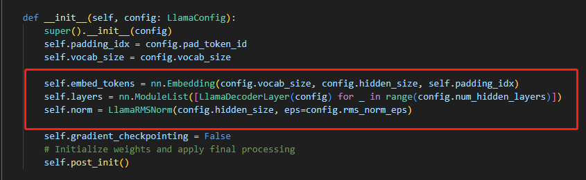
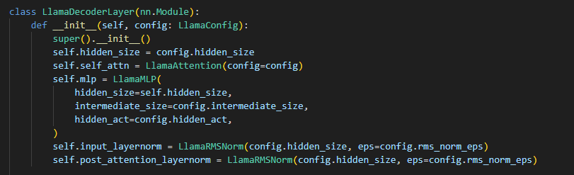

# Today's work
- [x] Finetune enviorment  
- [x] finetune baichuan  
hiyouga/LLaMA-Efficient-Tuning: Fine-tuning LLaMA with PEFT (PT+SFT+RLHF with QLoRA) (github.com)  
CUDA_VISIBLE_DEVICES=0 python src/train_sft.py \  
    --model_name_or_path /root/baichuan/baichuan-7B/baichuan-7B \  
    --do_train \  
    --dataset up-07-03-doc-merged \  
    --finetuning_type lora \  
    --lora_rank 8 \  
    --lora_target W_pack \   
    --output_dir up-07-03-model1 \ 
    --per_device_train_batch_size 4 \  
    --per_device_eval_batch_size 4 \  
    --gradient_accumulation_steps 8 \  
    --lr_scheduler_type cosine \  
    --logging_steps 10 \  
    --save_steps 100 \  
    --eval_steps 100 \   
    --learning_rate 5e-5 \  
    --max_grad_norm 0.5 \  
    --num_train_epochs 30.0 \  
    --dev_ratio 0.01 \  
    --evaluation_strategy steps \  
    --load_best_model_at_end \  
    --plot_loss \  
    --fp16  
- [ ] test baichuan finetune  
python src/web_demo.py \  
    --model_name_or_path /root/baichuan/baichuan-7B/baichuan-7B \  
    --checkpoint_dir up-07-03-model1/  
- [ ] Baichuan model -> 32K  
# Questions
1. what if we have input seq larger than 2048? Should we just change the input length of the model? The rest of the blank part just use padding then?

  
    1. Change the hidden_size, then think about attention.  
# Gossip
# Proposed work 
- [ ] Read PEFT Repo, typing, dataclasses library    
- [ ] Read finetune and inference code    
- [ ] Read achitecture source code      
- [ ] Langchain and documentsearch(local library)  
DocumentSearch/demo.py at main · yuanzhoulvpi2017/DocumentSearch (github.com)  https://github.com/yuanzhoulvpi2017/DocumentSearch/blob/main/demo.py  
imClumsyPanda/langchain-ChatGLM: langchain-ChatGLM, local knowledge based ChatGLM with langchain ｜ 基于本地知识库的 ChatGLM 问答 (github.com)  https://github.com/imClumsyPanda/langchain-ChatGLM  
- [ ] Write my own lora training file(possible for chatglm2)  
- [ ] Understand all generate and finetune souce code and try to write fine tune file with peft  
# After work 30 mins
- [ ] Learn more generative AI from Hung-yi Lee course  
- [ ] Complete my Python base (100 days with Python)  
jarodHAN/Python-100-Days-master: python100天学习资料 (github.com)  https://github.com/jarodHAN/Python-100-Days-master  
- [ ] Create a data scientist resume  
- [ ] apply for fall job  

