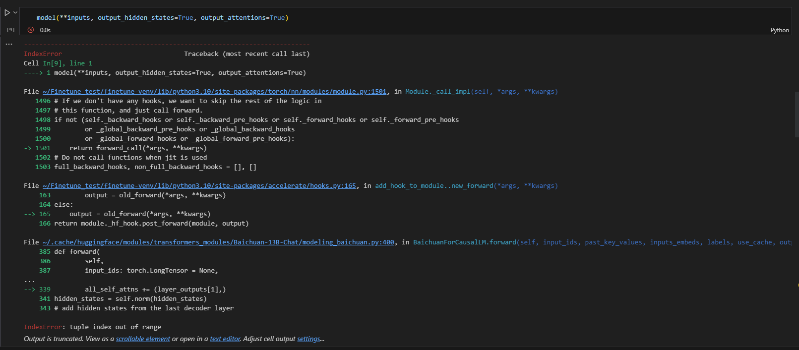
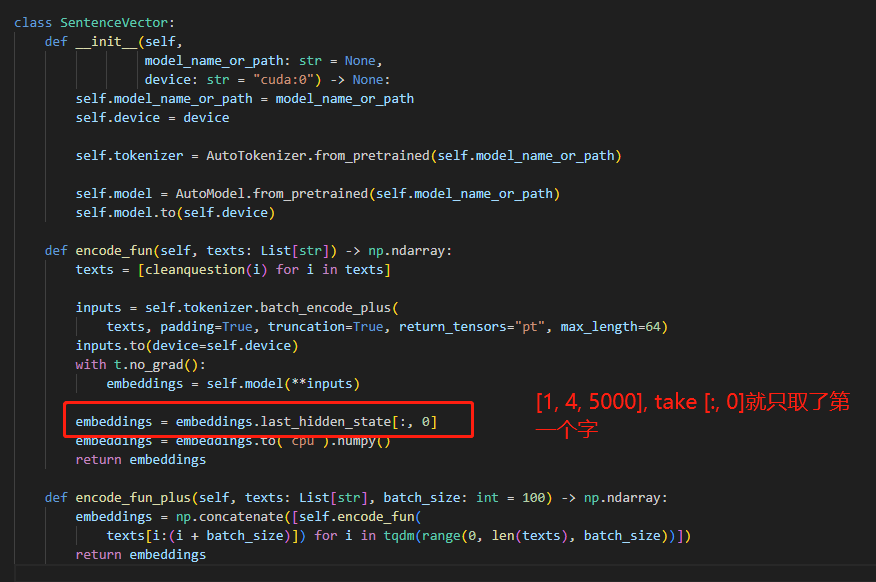

# Today's work
- [x] test the finetune result  
python finetune_baichuan.py --base_model 'Baichuan-13B-Chat' --data_path 'data/up-2023-7-13-superstar-xiaojue.json' --output_dir './Finetune-model/finetune-baichuan-up-1' --num_epochs 20 --learning_rate 1e-4 --cutoff_len 1024 --val_set_size 0  --add_eos_token True  
python generate_baichuan.py --base_model 'Baichuan-13B-Chat/'     --lora_weights 'Finetune-model/finetune-baichuan-up-1/checkpoint-300'  
- [x] set the next steps:
1. multiply rounds converstation about escape the locked room with the backgrounds.  
- [x] Similarity check
make a dictionary that contains the match-word: info  
embedding the match-word via tokenizer and model.forward  
do the same embedding for the sentence(question) as input  
match the two embedding and find the best one   
# Questions
1. The output vector is not the same seq_len, we may need attention score to make a pooling.  
   
    1. Just use Text2vec instead of using this. Avg pooling is not a good one.  
3. The document search may have a potential problem, it only take the first seq for matching.  
   
    1. make a test of document search project  
# Gossip
# Proposed work
- [ ] take the ai vtuber project into account  
Ikaros-521/AI-Vtuber: AI Vtuber是一个由 【ChatterBot/ChatGPT/claude/langchain本地or云端/chatglm/text-generation-webui】 驱动的虚拟主播【Live2D】，可以在 【Bilibili/抖音/快手】 直播中与观众实时互动 或 直接在本地进行聊天。它使用自然语言处理和文本转语音技术【edge-tts/VITS/elevenlabs】生成对观众问题的回答并可以选择【so-vits-svc】变声；通过特定指令协同Stable Diffusion进行画图展示。并且可以自定义文案进行循环播放。 (github.com)  
【AI主播】接入ChatterBot/GPT 由Edge-TTS/VITS实现语音合成，简单讲解分享_哔哩哔哩_bilibili  
- [ ] make a test of document search project  
- [ ] look at the phoneme translate model  
# After work
- [ ] Linux Learning
第三章-03-查看权限控制信息_哔哩哔哩_bilibili
- [ ] Create a data scientist resume  
- [ ] apply for fall job  

