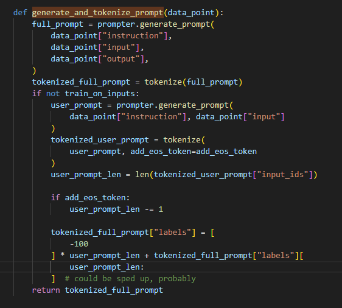

# Today's work  
- [x] Use command in jupyter to finetune two model to compare the performance.  
train-baichuan-up.ipynb  
- [x] test the training result  
python generate_baichuan.py --base_model 'Baichuan-13B-Chat/'     --lora_weights 'Finetune-model/finetune-baichuan-up-2/checkpoint-100'  
python generate_baichuan.py --base_model 'Baichuan-13B-Chat/'     --lora_weights 'Finetune-model/finetune-baichuan-up-3/checkpoint-300'  
- [x] test gpt4 roleplay for generating new data with owned questions.  
- [ ] my next step:  
1. the model is stupid, rely on the model does not make sense. Give few shots in prompt, and then use the langchain to use the existed question to ask gpt4 with gpt4 role play.(finetune parameters mask instruction)  
2. test different prompt+few shots  
3. train the base model with basic info  
# Questions
1. Why train_on_inputs can works?  
     
# Gossip
#Proposed work
- [ ] take the ai vtuber project into account  
Ikaros-521/AI-Vtuber: AI Vtuber是一个由 【ChatterBot/ChatGPT/claude/langchain本地or云端/chatglm/text-generation-webui】 驱动的虚拟主播【Live2D】，可以在 【Bilibili/抖音/快手】 直播中与观众实时互动 或 直接在本地进行聊天。它使用自然语言处理和文本转语音技术【edge-tts/VITS/elevenlabs】生成对观众问题的回答并可以选择【so-vits-svc】变声；通过特定指令协同Stable Diffusion进行画图展示。并且可以自定义文案进行循环播放。 (github.com)
【AI主播】接入ChatterBot/GPT 由Edge-TTS/VITS实现语音合成，简单讲解分享_哔哩哔哩_bilibili  
- [ ] check the tts process I did before and check my phoneme translate model   
- [ ] Maybe use Bert to train, make the last output layer out and no sofrmax after that, then use a conversion between sr and time, so we can get the distribution of prob for each phoneme at any second   
# After work
- [ ] Linux Learning  
第三章-03-查看权限控制信息_哔哩哔哩_bilibili  
- [ ] Create a data scientist resume  
- [ ] apply for fall job  
