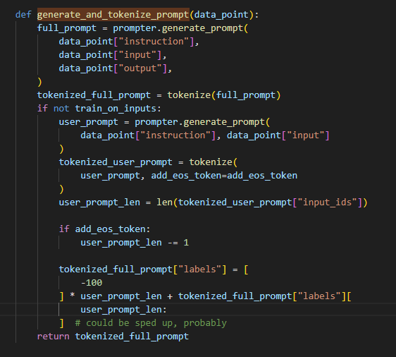

# Today's work  
- [x] Gain the daily commuinication data(if possible, make it like NPC said)  
- [x] check the usage and source code of train_on_inputs  
- [x] Finetune the model with train_on_inputs False, and compare the difference.  
python finetune_baichuan.py --base_model 'Baichuan-13B-Chat' --data_path 'data/mishi-07-21.json' --output_dir './Finetune-model/finetune-baichuan-up-4' --num_epochs 5  --learning_rate 1e-4 --cutoff_len 1024 --val_set_size 0  --add_eos_token True --train_on_inputs False  
# Questions  
1. Why train_on_inputs can works?  
  
    a. Just change the token to -100 for instruction and input part in labels and calculate the loss for the rest.  
# Gossip  
# Proposed work  
- [ ] gain base model baichuan-13B  
- [ ] Train the model with daily communication data to get chat model  
- [ ] refine the special data one by one  
- [ ] use the special data as local library for inference  
# After work
- [x] Linux Learning  
- [ ] Create a data scientist resume  
- [ ] apply for fall job  
